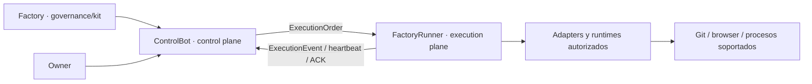

# FactoryRunner

> Execution plane programático y auditable para ejecutar órdenes gobernadas por ControlBot.

**Rol en la fábrica:** execution plane · **Fase:** construction · **Roadmap:** GitHub Issues + [Factory #168](https://github.com/pl0n3r/Factory/issues/168)

FactoryRunner ejecuta trabajo; no decide prioridades, no amplía autoridad y no almacena secretos del dueño. Su runtime objetivo es Node.js 24 + TypeScript con contratos Factory, portable al hosting disponible y con ejecución local solo como fallback operativo.

## Operational Cockpit

<!-- factory:status:start -->
| Señal | Estado |
| --- | --- |
| main SHA | UNKNOWN |
| versión | UNKNOWN |
| CI | UNKNOWN |
| release | UNKNOWN |
| health | UNKNOWN |
| smoke/observer | UNKNOWN |
| quality/security | UNKNOWN |
| Issue activo | UNKNOWN |
| PR activo | UNKNOWN |
| último release | UNKNOWN |
<!-- factory:status:end -->

### Progress + Readiness

<!-- factory:progress-readiness:start -->
| Señal | Estado |
| --- | --- |
| Target | UNKNOWN |
| Progress | UNKNOWN |
| Readiness | UNKNOWN |
| Evidence freshness | UNKNOWN |
| Critical blockers | UNKNOWN |
| Trend | UNKNOWN |

| Dimensión | Progress | Readiness |
| --- | --- | --- |
| UNKNOWN | UNKNOWN | UNKNOWN |
<!-- factory:progress-readiness:end -->

> Los bloques anteriores son derivados. UNKNOWN/PENDING significa que falta evidencia canónica; nunca equivale a GREEN.

## Work Queue

- **NOW:** sin hoja disponible para ejecutar; el inventario completo, incluidos Issues bloqueados, está en [FactoryRunner Issues](https://github.com/pl0n3r/FactoryRunner/issues).
- **NEXT:** ninguno materializado. El siguiente trabajo debe nacer como Issue gobernado antes de reservarse o implementarse.
- **LATER:** ampliar adapters de ejecución y browser únicamente mediante Issues gobernados y capacidades explícitas.
- **BLOCKED:** [#431 — activación live](https://github.com/pl0n3r/FactoryRunner/issues/431) continúa bloqueado por puerta exclusiva del dueño y evidencia pendiente de compatibilidad ControlBot, health/readiness, observabilidad y rollback. No representa una hoja disponible ni autoriza go-live. El repositorio público es el estado canónico según D-062; PII, credenciales, cookies y secretos siguen prohibidos en el repositorio.

Referencias de baseline: [#20 — README Contract v1](https://github.com/pl0n3r/FactoryRunner/issues/20) · [Factory #168 — bootstrap/arquitectura](https://github.com/pl0n3r/Factory/issues/168).

Esta cola es un resumen operativo; los Issues son la planificación canónica y el README no funciona como changelog.

## Qué hace el producto

FactoryRunner materializa el plano de ejecución de la fábrica:

- identidad, heartbeat y manifest de capacidades del runner;
- validación y ejecución idempotente de órdenes emitidas por ControlBot;
- publicación de eventos de ejecución y ACKs;
- adapters de browser/runtime con límites explícitos;
- aislamiento de autoridad: recibe trabajo gobernado, pero no decide qué trabajo priorizar.

El estado durable y la dirección de negocio pertenecen a ControlBot; FactoryRunner conserva únicamente el estado mínimo necesario para ejecutar contratos de forma segura.

## Arquitectura en 60 segundos



ControlBot decide elegibilidad y despacho. FactoryRunner valida la orden, ejecuta solo capacidades permitidas y devuelve evidencia. AutoFactory permanece separado como herramienta local/manual.

## Stack e infraestructura

- **Runtime:** Node.js 24 LTS + TypeScript.
- **Contratos compartidos:** Factory Kit v1.
- **Transporte:** cliente ControlBot tipado para polling, heartbeat, ACK y eventos.
- **Hosting objetivo actual:** Hostinger Shared/Web Hosting, sin asumir Docker, root ni Chromium local.
- **Fallback:** ejecución local en macOS solo cuando una capacidad no sea viable en hosting compartido.
- **Estado durable de negocio:** ControlBot; FactoryRunner no introduce una base de datos paralela por defecto.

## Ciclo de entrega

Issue → reserva → `trabajo/issue-N` → PR → Factory CI/policy/acceptance → revisión → merge serial → release → validación exact-main.

Una ejecución o merge no demuestra por sí solo salud del runtime. Cualquier futura señal live deberá conservar identidad exacta, evidencia y semántica fail-closed.

## Calidad y seguridad

- Sin passwords, private keys, cookies, tokens de sesión ni credenciales dentro de órdenes o del repositorio.
- Alias/referencias sustituyen identidades sensibles cuando basta para el contrato.
- Permisos y capabilities se mantienen mínimos; el Runner nunca expande su propia autoridad.
- CI consume Factory v1 y ejecuta typecheck, tests Node y contratos Python.
- Los cambios de seguridad, runtime o ejecución privilegiada requieren evidencia reproducible y rollback definido.
- CAPTCHA, MFA y rate limits no se evaden.

## Roadmap y fuentes de verdad

- Gobierno común: [pl0n3r/Factory](https://github.com/pl0n3r/Factory) y su `PLAN-AGENTES.md`.
- Bootstrap/arquitectura del Runner: [Factory #168](https://github.com/pl0n3r/Factory/issues/168).
- Trabajo propio: [FactoryRunner Issues](https://github.com/pl0n3r/FactoryRunner/issues).
- Decisiones vigentes: `decisiones.yml`.
- Datos y tratamiento: `datos.yml`.
- Contrato operativo del agente: `AGENTES.md`.
- Documentación profunda: `docs/`.

Estas fuentes mandan sobre snapshots históricos del README.

## Desarrollo local

Requisitos: Node.js 24 LTS, npm y Python 3 para los contratos auxiliares.

```bash
npm ci --ignore-scripts --no-audit --no-fund
npm run typecheck
npm test
npm run build
python3 -m unittest discover -s tests -p 'test_*.py'
```

No se requieren credenciales reales para ejecutar la suite de contratos.

## Mapa de la fábrica

- **Factory** — governance/kit y contratos comunes.
- **ControlBot** — control plane, priorización, elegibilidad y estado durable.
- **FactoryRunner** — execution plane; ejecuta órdenes ya gobernadas y reporta evidencia.
- **Condor / GrindFlow / BRVTAL** — productos construidos por la fábrica.
- **AutoFactory** — herramienta local/manual del dueño.

**AutoFactory no se migra ni se modifica desde FactoryRunner.** Los dos productos pueden coexistir y evolucionar de forma independiente.
